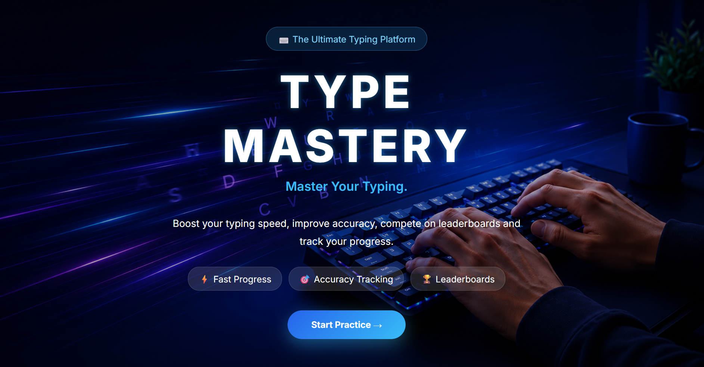
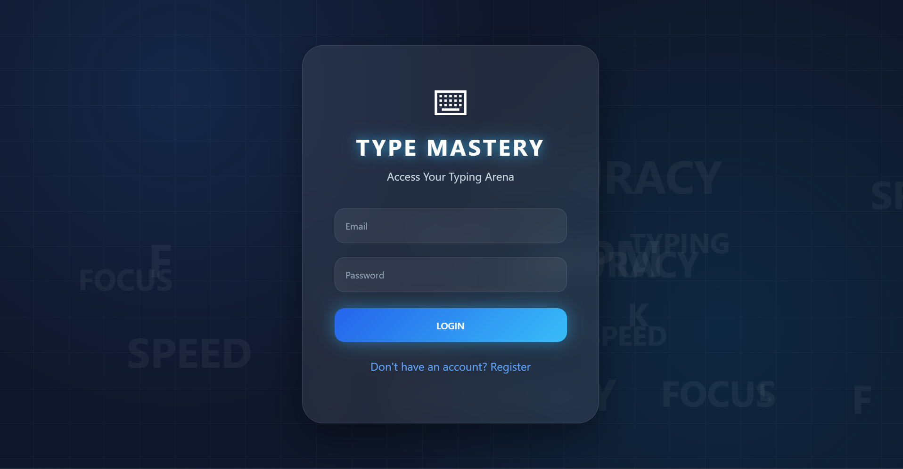
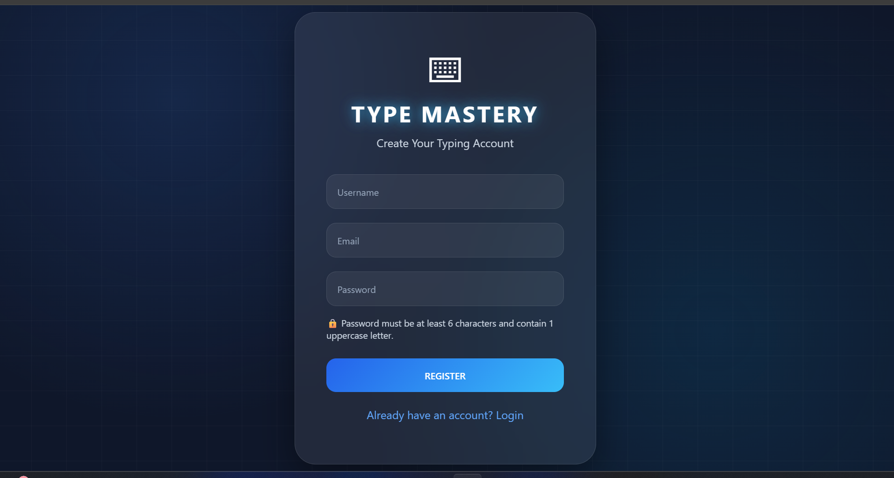
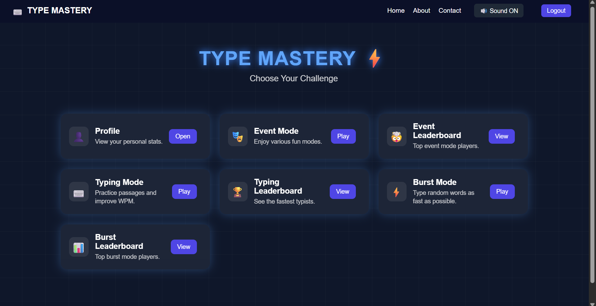
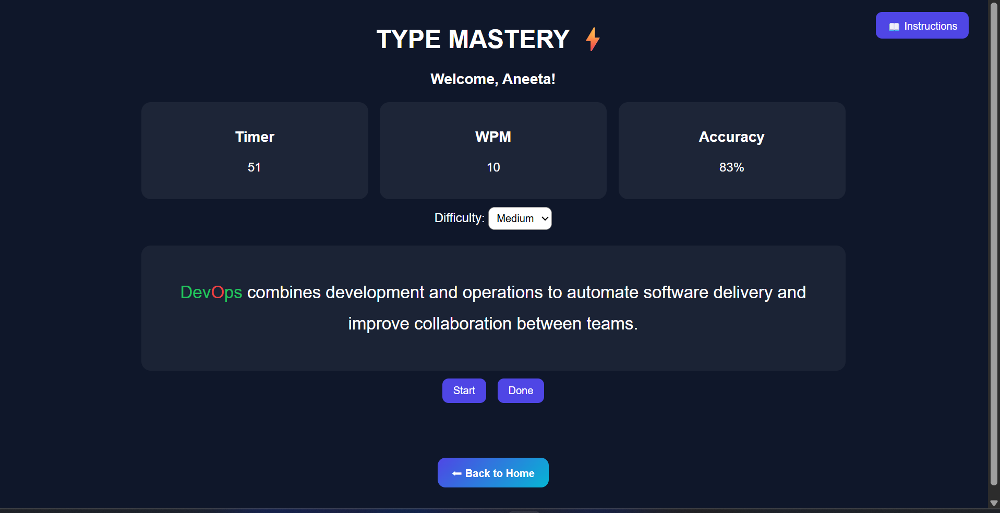
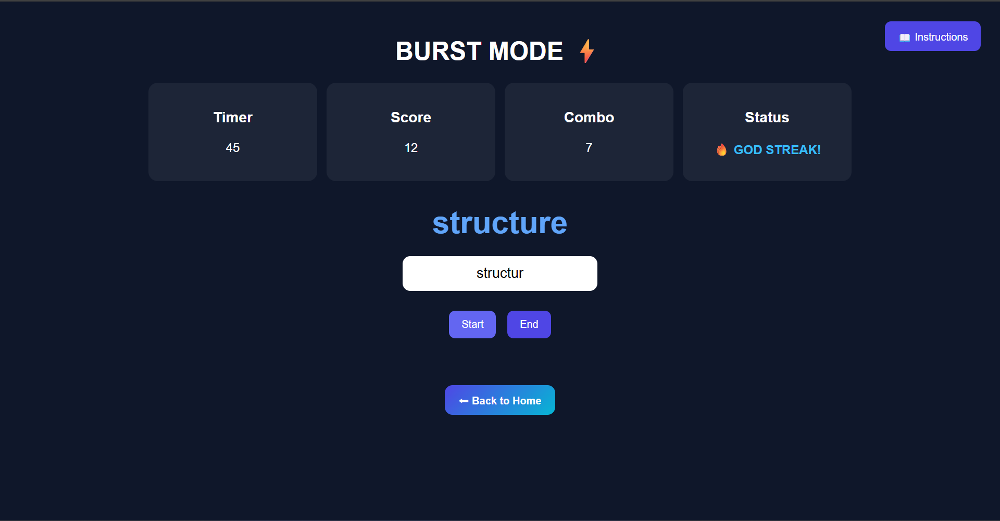
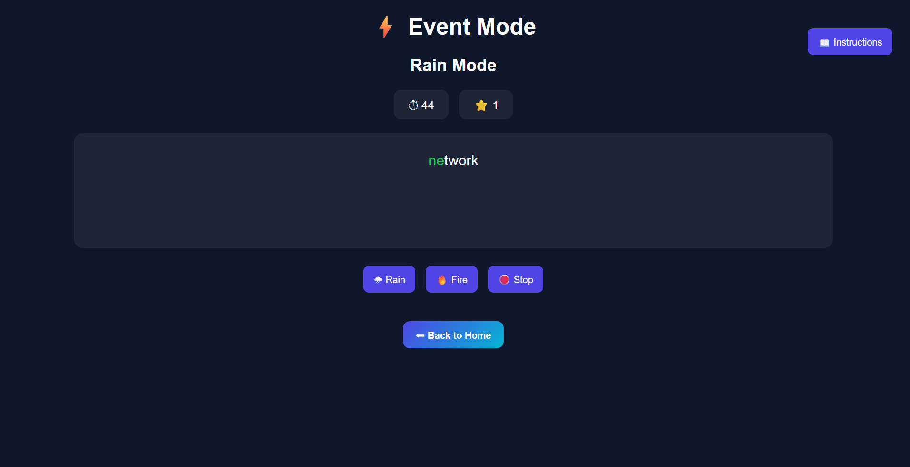
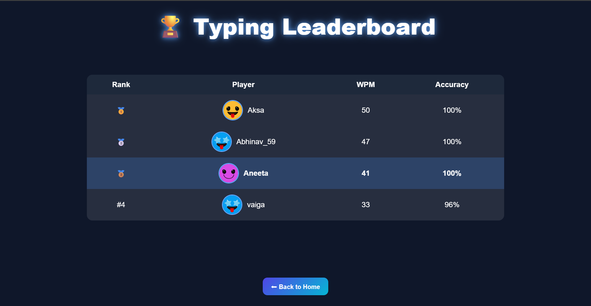
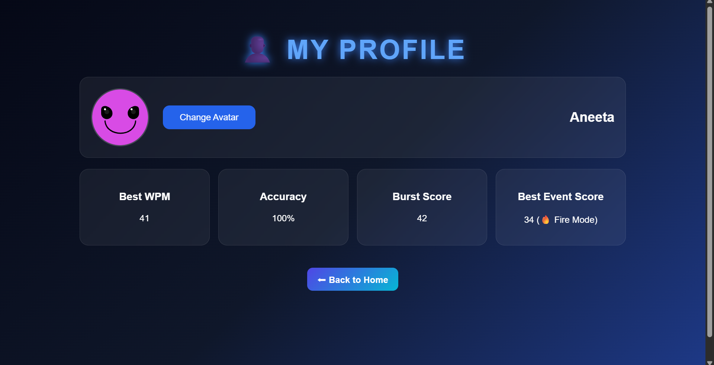

# ⌨️ Type Mastery

A modern full-stack typing practice web application designed to improve typing speed, accuracy, and consistency through multiple interactive game modes, real-time leaderboards, and an engaging user experience.

## 🌐 Live Demo

🔗 https://typing-speed-enhancer.vercel.app

---

# 📖 Overview

**Type Mastery** is a feature-rich typing platform where users can register, log in, practice typing through multiple game modes, compete on leaderboards, and monitor their personal progress.

Built using **HTML, CSS, JavaScript, Node.js, Express.js, and MongoDB Atlas**, the application is deployed using **Vercel** (Frontend) and **Render** (Backend).

---

# ✨ Features

## 🔐 Authentication

- User Registration
- Secure Login
- Logout
- Local Storage session management

---

## ⌨️ Typing Mode

- Real-time typing practice
- Live WPM calculation
- Accuracy tracking
- Correct characters highlighted in green
- Incorrect characters highlighted in red
- Last 5-second visual countdown animation
- Restart option

---

## ⚡ Burst Mode

A fast-paced typing challenge featuring:

- Combo System
- Fever Mode
- Particle Effects
- Dynamic Scoring
- Progressive Difficulty
- Bonus Time Rewards
- No repeated words until all words have been used
- Sound Effects

---

## 🎭 Event Mode

Choose between two unique challenge modes:

### 🌧️ Rain Mode

- Relaxed typing challenge
- Timed word replacement
- Background stress music

### 🔥 Fire Mode

- Faster disappearing words
- Higher score multiplier
- Increased difficulty
- Background stress music

---

## 🏆 Leaderboards

Compete with players through dedicated leaderboards:

- Typing Leaderboard
- Burst Leaderboard
- Event Leaderboard

All scores are securely stored in **MongoDB Atlas**.

---

## 👤 User Profile

Each user has a personal profile displaying:

- Username
- Best Scores
- Personal Statistics
- Performance Summary

---

## 🎵 Audio Experience

Interactive sound effects improve the gameplay experience:

- Button Click Sounds
- Fever Mode Sound
- Combo Reset Sound
- Event Mode Background Music

---

## 📱 Responsive Design

Fully optimized for:

- 💻 Desktop
- 💼 Laptop
- 📱 Mobile
- 📟 Tablet

---

# 🛠 Tech Stack

### Frontend

- HTML5
- CSS3
- JavaScript

### Backend

- Node.js
- Express.js

### Database

- MongoDB Atlas
- Mongoose

### Deployment

- Vercel (Frontend)
- Render (Backend)

---

# 📸 Screenshots

| Index Page | Login |
|------------|-------|
|  |  |

| Registration | Home |
|--------------|------|
|  |  |

| Typing Mode | Burst Mode |
|-------------|------------|
|  |  |

| Event Mode | Leaderboard |
|------------|-------------|
|  |  |

| Profile |
|---------|

  

# 🎯 Future Improvements

- Achievement Badges
- Weekly & Monthly Leaderboards
- Paragraph Typing Mode
- Typing Progress Graphs
- User Avatars
- Theme Customization
- Multiplayer Mode
- More Event Modes

---

# 💡 What I Learned

Building **Type Mastery** helped me strengthen my skills in:

- Full Stack Web Development
- REST API Development
- MongoDB Integration
- Authentication & Session Handling
- Responsive UI Design
- JavaScript Event Handling
- Game Logic Development
- Frontend & Backend Integration
- Cloud Deployment using Vercel & Render

---

# 👨‍💻 Author

**Aksa Anoob**

GitHub: https://github.com/AksaAnoob

---

# ⭐ Support

If you enjoyed this project, consider giving it a ⭐ on GitHub!

Feedback and suggestions are always welcome!
